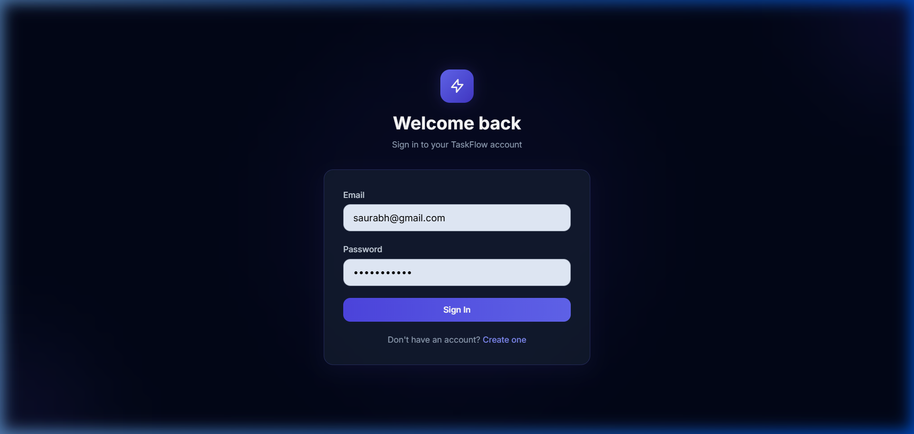
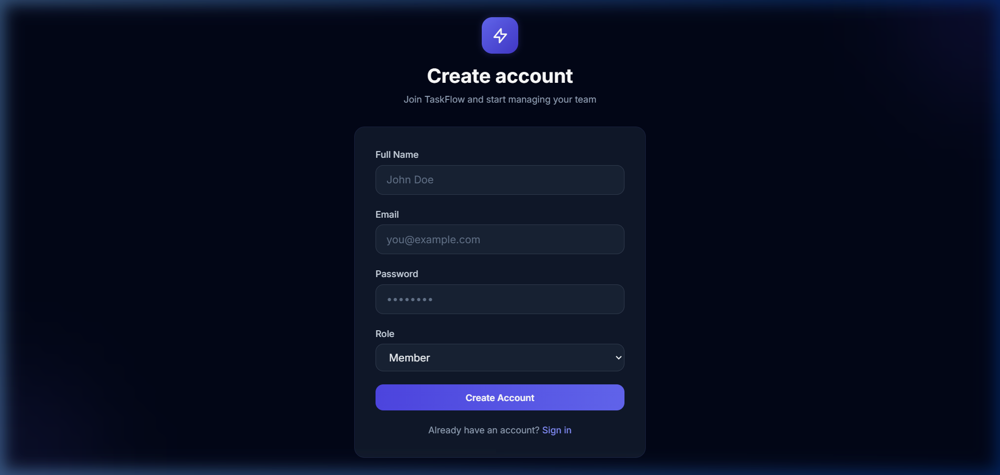
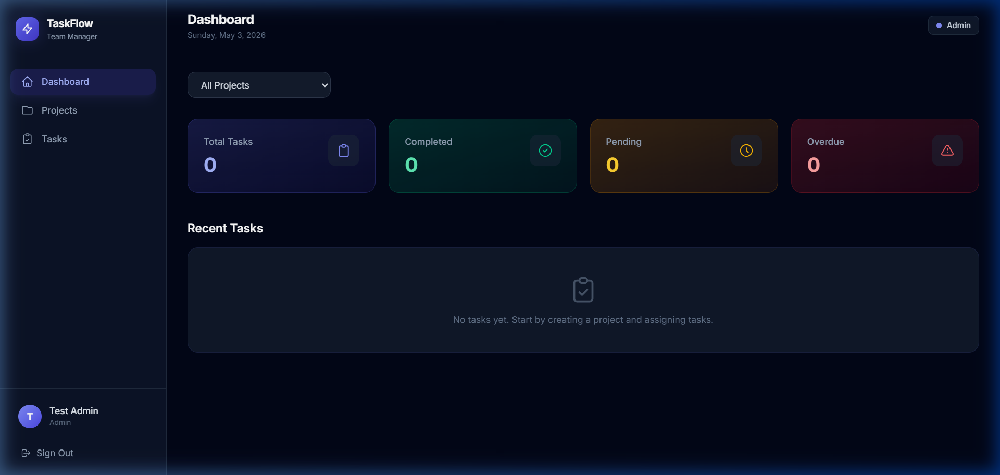
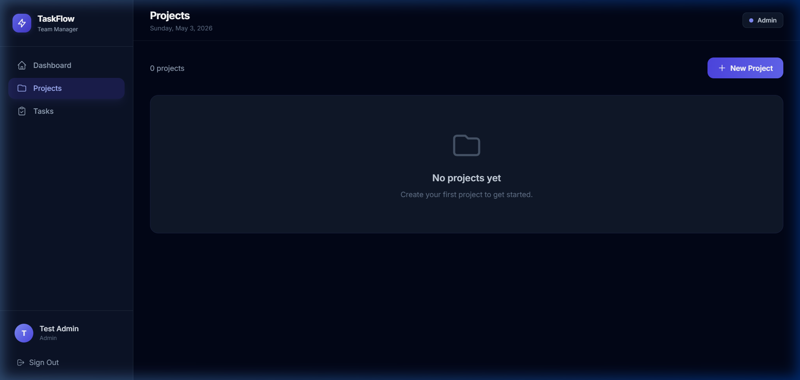
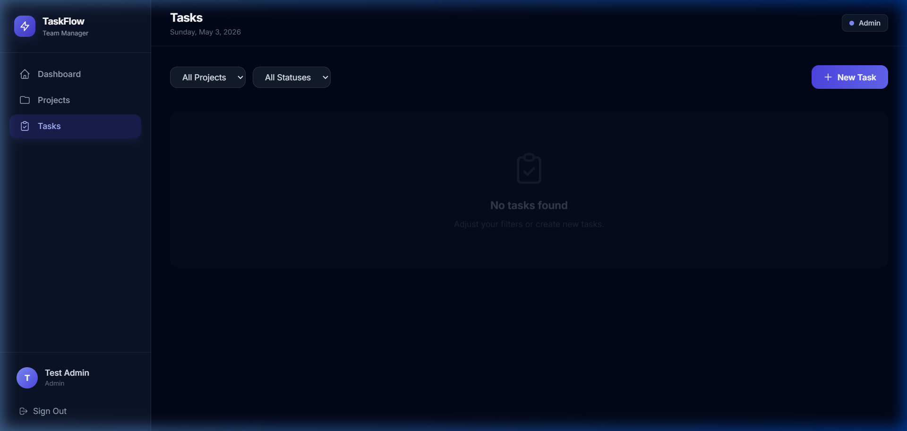

# ⚡ TaskFlow — Team Task Manager

A full-stack **Team Task Management** application built with **React**, **Node.js/Express**, and **MongoDB**. Features role-based access control (Admin/Member), project management, task assignment & tracking, and a real-time dashboard.

---

## 📸 Screenshots / Output

### 🔐 Login Page


### 📝 Signup Page


### 📊 Dashboard


### 📁 Projects Page


### ✅ Tasks Page


---

## 🛠️ Tech Stack

| Layer      | Technology                                  |
|------------|---------------------------------------------|
| Frontend   | React 19, Vite 6, Tailwind CSS 4            |
| Backend    | Node.js, Express.js                         |
| Database   | MongoDB Atlas (Mongoose ODM)                |
| Auth       | JWT (JSON Web Tokens), bcrypt.js            |
| Validation | express-validator                           |
| Security   | Helmet, CORS                                |

---

## 📂 Project Structure

```
Team-Task-Manager/
├── backend/
│   ├── config/
│   │   └── db.js                # MongoDB connection
│   ├── controllers/
│   │   ├── authController.js    # Signup, Login, Get User
│   │   ├── projectController.js # CRUD for Projects
│   │   └── taskController.js    # CRUD for Tasks
│   ├── middleware/
│   │   ├── auth.js              # JWT authentication
│   │   ├── errorHandler.js      # Global error handler
│   │   └── roleCheck.js         # Role-based access control
│   ├── models/
│   │   ├── User.js              # User schema
│   │   ├── Project.js           # Project schema
│   │   └── Task.js              # Task schema
│   ├── routes/
│   │   ├── authRoutes.js
│   │   ├── projectRoutes.js
│   │   └── taskRoutes.js
│   ├── validators/
│   │   ├── authValidator.js
│   │   ├── projectValidator.js
│   │   └── taskValidator.js
│   ├── server.js                # Express app entry point
│   ├── package.json
│   └── .env.example
├── frontend/
│   ├── src/
│   │   ├── api/
│   │   │   └── axios.js         # Axios instance + interceptors
│   │   ├── components/
│   │   │   ├── Layout.jsx       # App layout with sidebar
│   │   │   ├── Navbar.jsx       # Top navigation bar
│   │   │   ├── ProtectedRoute.jsx
│   │   │   ├── Sidebar.jsx      # Sidebar navigation
│   │   │   └── StatsCard.jsx    # Dashboard stat cards
│   │   ├── context/
│   │   │   └── AuthContext.jsx  # Auth state management
│   │   ├── pages/
│   │   │   ├── Login.jsx
│   │   │   ├── Signup.jsx
│   │   │   ├── Dashboard.jsx
│   │   │   ├── Projects.jsx
│   │   │   ├── ProjectDetail.jsx
│   │   │   └── Tasks.jsx
│   │   ├── App.jsx
│   │   ├── App.css
│   │   ├── index.css
│   │   └── main.jsx
│   ├── package.json
│   ├── vite.config.js
│   └── .env.example
├── screenshots/                 # Output screenshots
└── README.md
```

---

## ✨ Features

### Authentication & Authorization
- 🔐 **JWT-based authentication** with secure token management
- 👥 **Role-based access control** — Admin & Member roles
- 🔄 **Auto token refresh** and 401 handling via Axios interceptors
- 🛡️ **Protected routes** — unauthenticated users are redirected to login

### Project Management (Admin Only)
- ➕ Create new projects with name & description
- 👥 Assign / update team members for each project
- 📋 View all projects and project details

### Task Management
- ➕ **Admins** can create tasks and assign to team members
- 📝 **Members** can update task status (To Do → In Progress → Done)
- 🔍 Filter tasks by **project** and **status**
- 📊 Task statistics on the dashboard (Total, Completed, Pending, Overdue)

### Dashboard
- 📈 Overview stats with colorful gradient cards
- 📋 Recent tasks list
- 🔽 Filter by project

---

## 🚀 Getting Started

### Prerequisites

- **Node.js** v18+ installed
- **MongoDB Atlas** account (free tier works) or local MongoDB
- **Git** installed

### 1. Clone the Repository

```bash
git clone https://github.com/Saurabh5544/Team-Task-Manager.git
cd Team-Task-Manager
```

### 2. Setup Backend

```bash
cd backend
npm install
```

Create a `.env` file in the `backend/` directory:

```env
PORT=5000
MONGO_URI=mongodb+srv://<username>:<password>@cluster.mongodb.net/team-task-manager?retryWrites=true&w=majority
JWT_SECRET=your_super_secret_jwt_key_change_this
JWT_EXPIRES_IN=7d
NODE_ENV=development
CLIENT_URL=http://localhost:5173
```

### 3. Setup Frontend

```bash
cd ../frontend
npm install
```

Create a `.env` file in the `frontend/` directory:

```env
VITE_API_URL=http://localhost:5000/api
```

### 4. Run the Application

**Terminal 1 — Backend:**
```bash
cd backend
npm run dev
```

**Terminal 2 — Frontend:**
```bash
cd frontend
npm run dev
```

Open **http://localhost:5173** in your browser.

---

## 📡 API Endpoints

### Auth Routes (`/api/auth`)

| Method | Endpoint    | Description         | Access  |
|--------|-------------|---------------------|---------|
| POST   | `/signup`   | Register new user   | Public  |
| POST   | `/login`    | Login user          | Public  |
| GET    | `/me`       | Get current user    | Private |
| GET    | `/users`    | Get all users       | Private |

### Project Routes (`/api/projects`)

| Method | Endpoint          | Description          | Access     |
|--------|-------------------|----------------------|------------|
| POST   | `/`               | Create project       | Admin only |
| GET    | `/`               | Get all projects     | Private    |
| GET    | `/:id`            | Get project by ID    | Private    |
| PUT    | `/:id/members`    | Update project members | Admin only |

### Task Routes (`/api/tasks`)

| Method | Endpoint          | Description          | Access     |
|--------|-------------------|----------------------|------------|
| GET    | `/stats`          | Get task statistics  | Private    |
| POST   | `/`               | Create task          | Admin only |
| GET    | `/`               | Get all tasks        | Private    |
| PUT    | `/:id/status`     | Update task status   | Private    |

---

## 🔑 User Roles

| Role   | Permissions                                           |
|--------|-------------------------------------------------------|
| Admin  | Create projects, assign members, create tasks, manage everything |
| Member | View assigned projects/tasks, update task status       |

---

## 🌐 Deployment

### Deploy on Railway

1. Push your code to GitHub
2. Go to [railway.app](https://railway.app) and create a new project
3. Add a **MongoDB** service (or use your Atlas URI)
4. Add a **Node.js** service → connect your GitHub repo
5. Set the root directory to `backend/`
6. Add environment variables (`MONGO_URI`, `JWT_SECRET`, etc.)
7. Deploy the frontend separately or serve via backend in production mode

### Environment Variables for Production

```env
NODE_ENV=production
PORT=5000
MONGO_URI=<your_production_mongodb_uri>
JWT_SECRET=<strong_random_secret>
JWT_EXPIRES_IN=7d
CLIENT_URL=<your_frontend_url>
```

---

## 👤 Author

**Saurabh Sharma**  
GitHub: [@Saurabh5544](https://github.com/Saurabh5544)

---

## 📄 License

This project is open source and available under the [MIT License](LICENSE).
